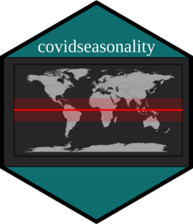
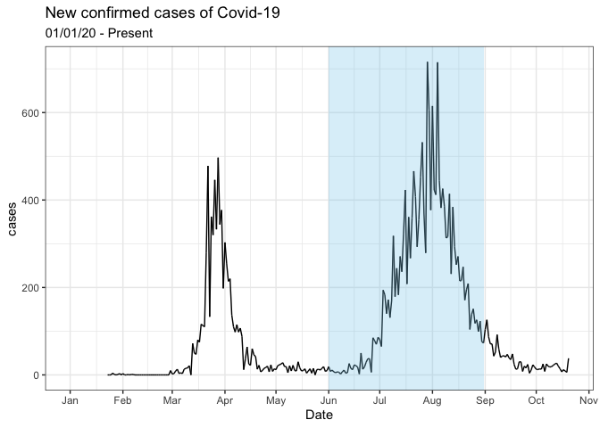

<!-- README.md is generated from README.Rmd. Please edit that file -->

# covidseasonality 

<!-- badges: start -->

<!-- badges: end -->

`covidseasonality` package aims to assess the novel coronavirus
seasonality effects by examining the cases in each hemisphere as cold
weather migrates to the Northern Hemisphere. Also, it improves its
corresponding app’s accessibility and readability.

## Installation

<!-- You can install the released version of covidseasonality from [CRAN](https://CRAN.R-project.org) with: -->

<!-- ``` r -->

<!-- install.packages("covidseasonality") -->

<!-- ``` -->

You can install the development version from GitHub with:

``` r
# install.packages("devtools")
devtools::install_github("etc5523-2020/r-package-assessment-brenwin1")
```

## Get Started

This is a some basic examples what the package does

Access inbuilt datasets such as countries in the Northern and Southern
Hemisphere and Tropics

``` r
library(covidseasonality)
library(tibble)

Northern_hemis # countries in the Northern Hemisphere
#> # A tibble: 100 x 1
#>    country             
#>    <chr>               
#>  1 Afghanistan         
#>  2 Albania             
#>  3 Andorra             
#>  4 United Arab Emirates
#>  5 Armenia             
#>  6 Austria             
#>  7 Azerbaijan          
#>  8 Belgium             
#>  9 Bangladesh          
#> 10 Bulgaria            
#> # … with 90 more rows
```

Takes inbuilt data sets and plot daily cases against date with shaded
area indicating winter months. Now you can extend this to include
countries in the world.

``` r
library(dplyr)
join_data <- covidseasonality::country_list %>% 
  filter(country == "Australia") %>% 
  covidseasonality::join_data()

join_data %>% 
  covidseasonality::plot_countries_hemis()
```



``` r
join_data(join_data) %>% 
  summary_table() 
```

| Country   | Total cases | Total cases per 100k | average cases | average cases per 100k |
| :-------- | ----------: | -------------------: | ------------: | ---------------------: |
| Australia |  49,507,172 |              195,184 |           101 |                      0 |

It can also launch the app with a single function. Furthermore, there
are also inbuilt functions that controls the inputs of the app.

``` r
# not run
# covidseasonality::launch_app()
```

## Learn more

Read `vignette("covidseasonality-intro")` for more details on how to use
the package.
