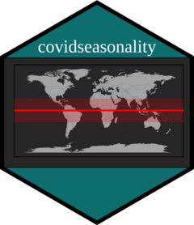

```{r, include = FALSE}
knitr::opts_chunk$set(
  collapse = TRUE,
  comment = "#>",
  message = FALSE,
  warning = FALSE,
  fig.width = 9,
  fig.height = 5
)
```

# 


# Introduction
The `covidseasonality` package assesses the novel coronavirus' cases in each hemisphere and the tropics, as cold weather migrates to the Northern Hemisphere in pandemic for the first time. It has also an embedded shiny app.


# The Shiny App
A preview of the app:

<video width="720" height="400" controls>
  <source src="../vignettes/shinyguide.mp4" type="video/mp4">
</video>


## Running the App
You can run the embedded Shiny app via one line of code. 
```{r setup}
library(covidseasonality)
# launch_app()
```

## Controlling which countries goes into the app
First you may want to look at the country and their corresponding hemisphere
```{r country_list}
library(tibble)
country_list
```

The app relies on one data set that can be obtained through a single function `join_data()`. Simply filter to the countries you want to analyse in the app.
```{r join_data}
library(dplyr)

join_data <- country_list %>% 
  filter(country == "Australia") %>% 
  covidseasonality::join_data()

join_data
```

## Controlling what goes into drop down menu in Tab 2
You could also determine countries that goes into drop down menu for each hemisphere or Tropics. This might help to declutter the menu.
```{r countries_hemis}
# --- outputs a Shiny selectInput
# x <- Southern_hemis %>% 
#   filter(country %in% c("Australia", "South Africa")) %>% 
#   countries_hemis()
```


# Some Useful Functions outside the App
These functions seek to facilitate analysis through visualization and tables. 

We can use `summary_table` to summarise the total cases & cases per 100,000 of the population as follows:
```{r summary_table}
join_data %>% 
  summary_table()
```


We could also make plots for countries in each hemisphere. First, to look at countries in Northern hemisphere, Southern hemisphere or Tropics, we use:
```{r hemis}
Northern_hemis

Southern_hemis

Tropics
```

Next, we make the plots. Sky blue shaded area represents winter months
```{r plot_countries_hemis}
join_data %>% 
  plot_countries_hemis()
```


```{r}
# WIP: These plots constructed using `ggplot2` allowing for additions if desired. 
# For example, instead of overlaying each countr(ies) plots over one another we could `facet` 
# to see the daily cases trend of both countries.

# 2 countries in Southern_hemis

# join_data <- country_list %>% 
#   filter(country %in% c("Australia", "New Zealand")) %>% 
#   covidseasonality::join_data()
# 
# join_data %>% 
#   plot_countries_hemis() +
#   ggplot2::facet_wrap(~country,
#              scales = "free_y")
```

